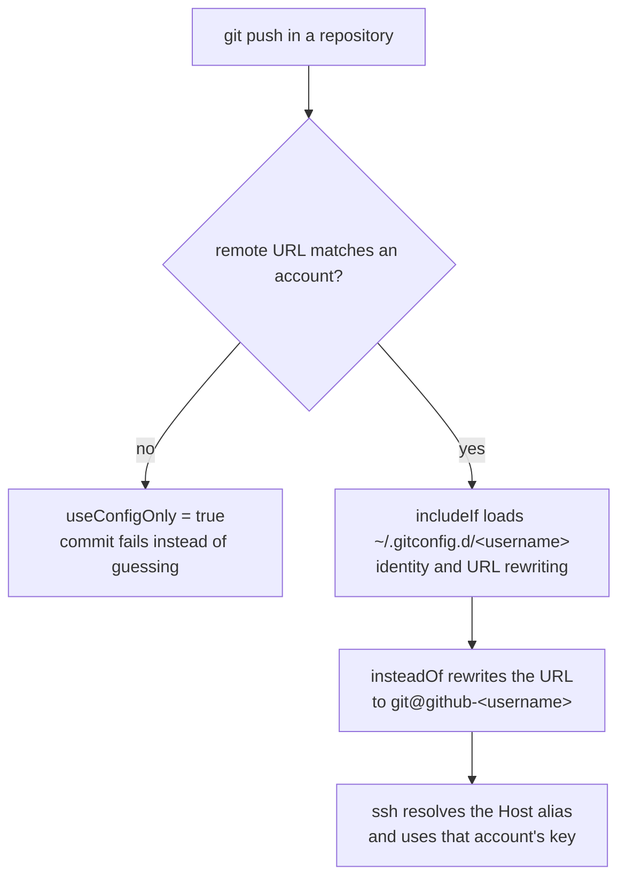

# Git account setup

Why account details are not tracked in this repository, and how `git account`
reproduces them on a new machine.

## Why nothing about an account is tracked

This repository is public, so a username, a commit address, or a key must never
appear in it. That rules out tracking the identity itself.

Little would be gained by tracking it anyway. A key cannot be copied between
machines usefully — each machine generates its own, and the public half has to
be registered with GitHub by hand. That manual step exists on every new machine
regardless of what this repository stores. So instead of reproducing the
settings, the repository reproduces the *procedure*: `git account` asks for
what only a person knows, generates what is missing, and writes the settings in
the correct shape.

What remains tracked is the structure: the shared settings, the two include
lines that pull in the untracked half, and the tool itself.

## How the identity is selected

Three mechanisms cooperate.

1. **SSH host aliases.** Each account gets a `Host github-<username>` entry that
   pins one `IdentityFile`. The alias, not `github.com`, selects the key.
2. **`url.<base>.insteadOf`.** Git rewrites `github.com` URLs to the matching
   alias at transport time, so ordinary clone URLs keep working.
3. **`includeIf "hasconfig:remote.*.url:"`.** Git pulls in the account's file
   based on the repository's remote URL.



`insteadOf` sits inside the account's file rather than beside the conditions.
That works because rewriting only has to be in effect once the repository has
already been matched, which keeps everything account-specific in one file.

`~/.gitconfig` sets `user.useConfigOnly = true` and no `user.name` or
`user.email`, so a repository matching no account cannot commit at all. Failing
is better than attributing a commit to the wrong account. Set the identity
locally (`git config user.email …`) where that is what you want.

## Layout

| Path | Tracked | Contents |
|---|---|---|
| `~/.gitconfig` | yes | Shared settings and one `include` line |
| `~/.ssh/config` | yes | One `Include` line |
| `~/.local/bin/git-account` | yes | This tool |
| `~/.gitconfig-accounts` | no | `includeIf` conditions, three per account |
| `~/.gitconfig.d/<username>` | no | Identity and `insteadOf` for one account |
| `~/.ssh/config.d/github-<username>.conf` | no | Host alias for one account |
| `~/.ssh/id_ed25519_<username>` | no | Key — generated per machine |

## Usage

```
git account add                add an account interactively
git account list               show configured accounts
git account status             show the identity applied here, and why
git account remove <username>  remove an account
```

`add` asks for the username, display name, address, and key path, offers to
generate the key if it is missing, then writes all three untracked pieces and
prints the public key to register at <https://github.com/settings/ssh/new>.
Generated keys are commented `<username>@<hostname>` so that the GitHub key
list shows which machine each key belongs to.

`status` reports which file the identity came from, the remote URL before and
after rewriting, and the key that ssh will use. When nothing matched it says so
rather than printing a fallback, which is the quickest way to see why a commit
is about to be refused.

`remove` deletes the account's file, its host alias, and its three conditions.
It keeps the key itself, because deleting a key is not reversible; delete it by
hand once it is registered nowhere, and remove it from
<https://github.com/settings/keys>.

`git account` works as a subcommand because git resolves an unknown command by
looking for `git-<name>` on `PATH`; no registration is needed beyond the file
being executable.

## Setting up a new machine

1. `make apply`
2. Run `git account add` once per account, registering each public key with
   GitHub when prompted.

Until the first account is added, commits fail by design.

## Notes

Five behaviours were confirmed by experiment and are easy to get wrong.

**`hasconfig` matches the raw URL.** The condition is evaluated against the URL
as written in the repository's config, *before* `insteadOf` rewriting —
`insteadOf` only rewrites at transport time and never touches the stored value.
A condition covering only `https://github.com/<username>/**` silently misses a
repository cloned as `git@github.com:<username>/...`, which then picks up
whatever identity is left. All three URL forms have to be listed, which is what
`git account add` does.

**`git config --global` writes into this repository.** `~/.gitconfig` is a
symlink into `configs/git/`, and git resolves the symlink and rewrites the real
file, leaving the link intact. Running `git config --global …` therefore dirties
the working tree here. Edit the file in the repository instead. `git account`
uses `git config --file` for the same reason.

**`includeIf` always needs two files,** one holding the condition and one read
when it matches, and `include.path` does not accept globs. The condition
contains the username so it cannot live in the tracked `~/.gitconfig`. That is
why `~/.gitconfig-accounts` exists; it holds nothing but `includeIf` lines.

**ssh keeps the first match,** so `Include ~/.ssh/config.d/*.conf` has to stay
above any `Host` block that could also match, or the included values lose.

**Stow would fold `~/.ssh` into this repository** on a machine where that
directory does not exist yet, which would make the working tree the place where
private keys land. The ssh package is therefore listed in `NOFOLD_PKGS` (see
README) so that a real directory is kept. Stow creates it with the ambient
umask, so `git account add` runs `install -d -m 700` before placing a key —
`install -d` corrects the mode of a directory that already exists, which
`mkdir -m` does not.

Two things turned out not to be problems: a missing `include` target is ignored
rather than an error, and `~/.ssh/config` at mode 664 is accepted (the strict
permission check applies to private keys, not the user config).

## Verifying

`git account status` covers the common case. To check a pattern without
cloning:

```
mkdir /tmp/t && git -C /tmp/t init -q
git -C /tmp/t remote add origin git@github.com:<username>/x.git
git -C /tmp/t config user.email
git -C /tmp/t ls-remote --get-url origin   # shows the rewritten URL
```

`ssh -G github-<username>` prints the resolved host settings without connecting.
