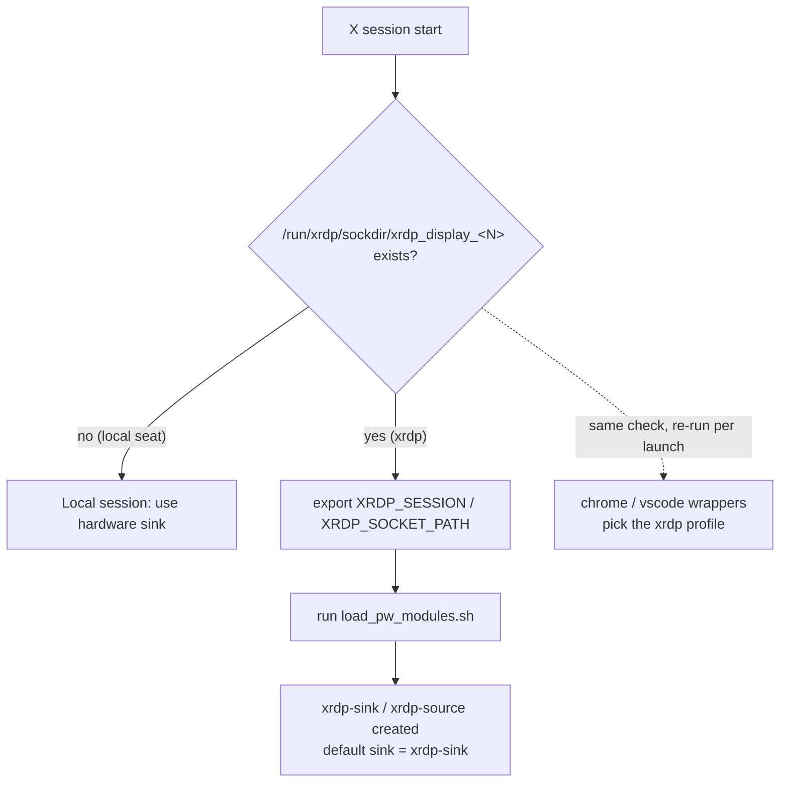

# Remote (xrdp) Audio

How audio works when logging in over xrdp on a PipeWire-based system, how it is
wired up in this repository, and how to reproduce it on another machine.

## Background

xrdp has no audio of its own. Sound is carried to the RDP client by an add-on
PipeWire module, [`pipewire-module-xrdp`][pkg] (community-maintained, packaged
in Ubuntu `universe` — **not** a native feature of PipeWire or xrdp).

The module provides a loader script, `load_pw_modules.sh`, that creates two
virtual PipeWire nodes inside the user's PipeWire instance:

- `xrdp-sink` — a virtual **output**. Audio routed here is forwarded over RDP
  and played on the remote client.
- `xrdp-source` — a virtual **input** (microphone) coming from the client.

`xrdp-sink` is therefore not something you install; it is created at runtime
when the loader runs inside an xrdp session.

## Why a local session can go silent

Local and xrdp sessions share **one** user-level PipeWire instance. When the
loader runs it sets the default sink to `xrdp-sink` (`pactl set-default-sink
xrdp-sink`), and that choice is **persisted** by WirePlumber under
`~/.local/state/wireplumber/default-nodes`.

If you later return to the local seat, the default may still point at
`xrdp-sink`, whose audio goes nowhere locally — so the machine is silent until
the default is pointed back at real hardware. Use `audio-out` (see below) to
switch it back.

## How it is wired in this repo

The loader must be triggered only inside xrdp sessions. This repo does that
entirely in **user space** (dotfiles), instead of editing the root-owned
`/etc/xrdp/startwm.sh`.

Both local and xrdp X sessions are started through `/etc/X11/Xsession`, which
sources `~/.xsessionrc`. That file (managed by the `xsession` package) detects
an xrdp session by its per-display control socket and, only then, exports the
session markers and launches the loader:

```sh
_xrdp_disp=${DISPLAY#:}; _xrdp_disp=${_xrdp_disp%%.*}
if [ -n "$_xrdp_disp" ] && [ -S "/run/xrdp/sockdir/xrdp_display_${_xrdp_disp}" ]; then
    export XRDP_SESSION=1
    export XRDP_SOCKET_PATH=/run/xrdp/sockdir
    [ -x /usr/libexec/pipewire-module-xrdp/load_pw_modules.sh ] && \
        /usr/libexec/pipewire-module-xrdp/load_pw_modules.sh &
fi
```

Both markers are **required by the loader**, which wraps its entire body in

```sh
if [ -n "$XRDP_SESSION" -a -n "$XRDP_SOCKET_PATH" ]; then
```

and otherwise exits 0 without creating anything — dropping either export makes
xrdp audio silently absent, with no error to notice.

They are, however, **not** a reliable session signal for anything spawned
outside the X session tree: `/etc/X11/
Xsession.d/95dbus_update-activation-env` copies the whole session environment
into the per-user (session-shared) systemd/D-Bus activation environment, which
only ever gains variables, so `XRDP_SESSION=1` survives there — and in
long-lived tmux servers — after the local session logs in. The `chrome` and
`vscode` wrappers therefore repeat the socket check against their own `$DISPLAY`
instead of reading the marker. See `docs/session-display.md`.



### Why detection is socket-based

`XRDP_SESSION` is normally set only by `/etc/xrdp/startwm.sh`. To keep the
wiring root-free, the session is instead detected from the xrdp control socket
`/run/xrdp/sockdir/xrdp_display_<N>` (owned by the user, so readable without
root), where `<N>` is the current `$DISPLAY` number. Local sessions have no
such socket for their display and simply skip the block.

> Note: i3 does not process XDG autostart (`/etc/xdg/autostart/*.desktop`), so
> the loader is **not** launched that way. `~/.xsessionrc` is the single
> trigger; there is no double launch.

## Setup on a new machine

```sh
# 1) Base packages (Ubuntu 24.04 ships PipeWire 1.0.5, which meets the >=0.3.58
#    requirement of the module).
sudo apt install xrdp

# 2) The xrdp PipeWire module (pulls libpipewire-0.3-modules-xrdp).
sudo apt install pipewire-module-xrdp

# 3) Apply the dotfiles that wire it up and add the switching tool.
cd ~/workspace/dotfiles
make apply pkg=xsession   # ~/.xsessionrc detection + loader launch
make apply pkg=audio      # ~/.local/bin/audio-out
```

No edits to `/etc/xrdp/startwm.sh`, no copy under `/usr/local/libexec`, and no
edits to the packaged autostart file are needed — those were legacy manual
steps that this user-space wiring replaces.

## Switching the output (`audio-out`)

`audio-out` (in the `audio` package) switches the default output and can play a
per-channel test tone:

```sh
audio-out          # pick an output from a menu and switch to it
audio-out --list   # list outputs (marks the current default)
audio-out --test   # play a left-only then right-only test tone
```

Typical use: after returning to the local seat, run `audio-out` and select the
local hardware output (e.g. the USB DAC) to move the default off `xrdp-sink`.

## Verification

Verify on a **fresh** xrdp login. A plain disconnect/reconnect resumes the same
session and does **not** re-run `~/.xsessionrc`; log out fully (end i3:
`$mod+Ctrl+q` → Yes), then reconnect over xrdp as a new login. Open a terminal
in the xrdp session and check:

1. Session markers exported (socket-based detection fired):
   ```sh
   echo "XRDP_SESSION=$XRDP_SESSION  XRDP_SOCKET_PATH=$XRDP_SOCKET_PATH"
   # expect: XRDP_SESSION=1  XRDP_SOCKET_PATH=/run/xrdp/sockdir
   ```
2. The loader ran and created the virtual sink:
   ```sh
   pactl list sinks short | grep xrdp-sink
   pactl get-default-sink                        # expect xrdp-sink
   ```
3. No double launch (the point of the user-space wiring):
   ```sh
   pactl list sinks short | grep -c xrdp-sink    # expect 1
   pgrep -af 'load_pw_modules|module-xrdp'        # a single launch only
   ```
4. Audio actually reaches the RDP client:
   ```sh
   audio-out --test    # left-then-right tone via the default (xrdp-sink)
   ```
5. `chrome` / `vscode` pick the xrdp profile (they key off `$DISPLAY`, not the
   markers):
   ```sh
   echo $DISPLAY                                  # :10 in the xrdp session
   ls /run/xrdp/sockdir/xrdp_display_10           # the socket the wrappers test
   ```

If `xrdp-sink` does not appear, see Troubleshooting.

## Troubleshooting

- **No sound on the local seat.** The default sink is probably still
  `xrdp-sink`. Run `audio-out` and select a hardware output, or:
  `pactl set-default-sink <hardware-sink-name>` (`pactl list sinks short`).
- **No sound over xrdp.** Confirm `pipewire-module-xrdp` is installed and that
  `xrdp-sink` exists (`pactl list sinks short`). Check the loader ran:
  `pgrep -af load_pw_modules`. Verify the socket exists for your display:
  `ls /run/xrdp/sockdir/xrdp_display_*`, and that PipeWire is up:
  `pw-cli info all >/dev/null && echo "pipewire up"`. Reproduce the loader by
  hand:
  ```sh
  XRDP_SESSION=1 XRDP_SOCKET_PATH=/run/xrdp/sockdir \
    /usr/libexec/pipewire-module-xrdp/load_pw_modules.sh
  ```
- **Current default and all sinks.** `wpctl status` (the `*` marks the default)
  or `pactl get-default-sink`.

[pkg]: https://github.com/neutrinolabs/pipewire-module-xrdp
