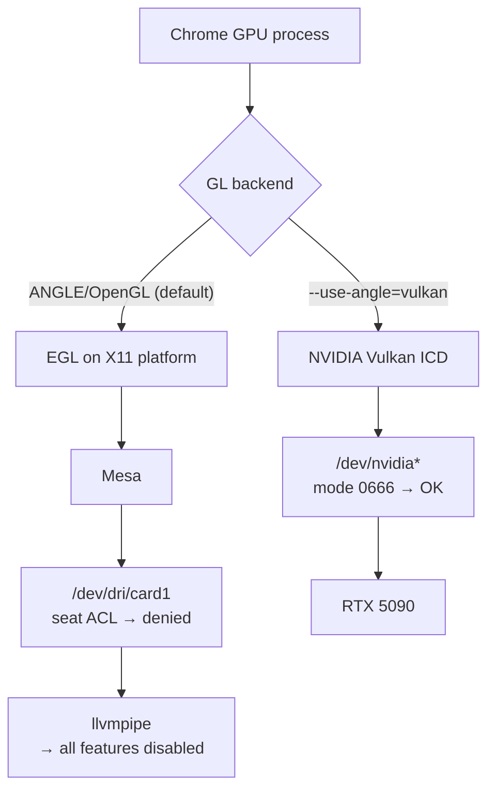

# GPU Acceleration in an xrdp Session

Why Chrome runs entirely on the CPU in an xrdp session on this NVIDIA machine,
why the usual remedies (`render` group, VirtualGL) do not apply, and how one
flag restores full hardware acceleration.

## Symptom

`chrome://gpu` in the xrdp session, with no flags:

```
Canvas         : Software only, hardware acceleration unavailable
Compositing    : Software only. Hardware acceleration disabled
Rasterization  : Unavailable
WebGL          : Unavailable
WebGPU         : Software only, hardware acceleration unavailable
Video Decode   : Unavailable
Vulkan         : Disabled
GL_RENDERER    : ANGLE (Mesa, llvmpipe (LLVM 20.1.2 256 bits), OpenGL 4.5 …)
```

with the decisive entry under *Problems Detected*:

```
GL driver is software rendered. GPU acceleration is disabled
  Disabled Features: accelerated_2d_canvas, accelerated_webgl,
    accelerated_video_decode, gpu_tile_rasterization, accelerated_gl,
    vulkan, accelerated_webgpu, skia_graphite, …
```

Chrome does not fail to find the GPU — it finds llvmpipe, concludes the driver
is software, and switches **everything** off, including paths that would have
worked.

## Root cause

Two independent facts combine.

**1. The xrdp X server has no GPU.** The session runs on xorgxrdp
(`Xorg :10 -config xrdp/xorg.conf`), a virtual video driver. Anything that goes
through the X server for GL — GLX, or EGL on the X11 platform — is served by
Mesa's software rasterizer:

```sh
$ glxinfo -B                       # on :10
Device: llvmpipe (LLVM 20.1.2, 256 bits)
Accelerated: no
```

**2. The GPU's DRI nodes are seat-restricted, but its NVIDIA nodes are not.**
`logind` grants `/dev/dri/*` to the user holding the seat via a POSIX ACL. An
xrdp login owns **no seat**, and this user is in neither `video` nor `render`:

```sh
$ getfacl /dev/dri/renderD128
user::rw-
user:lightdm:rw-        # seat holder only
other::---

$ ls -l /dev/nvidia0 /dev/nvidiactl
crw-rw-rw- … /dev/nvidia0
crw-rw-rw- … /dev/nvidiactl
```

So every **Mesa** route to the GPU (DRI3, EGL-X11, gbm) is closed — this is the
`libEGL warning: failed to open /dev/dri/card1: Permission denied` seen from
`eglinfo`. But NVIDIA's own userspace drivers reach the GPU through
`/dev/nvidia*`, which is world-accessible, and they work:

```sh
$ eglinfo -B -p surfaceless
EGL vendor string: NVIDIA
OpenGL core profile renderer: NVIDIA GeForce RTX 5090/PCIe/SSE2
OpenGL core profile version : 4.6.0 NVIDIA 590.48.01
```

The GPU is not unreachable. Only the *X11-mediated* GL path is dead.



## Fix

Force ANGLE's Vulkan backend when launching onto an xrdp display, in
`configs/chrome/.local/bin/google-chrome-stable`:

```sh
--use-angle=vulkan
```

The wrapper already branches on the xrdp control socket for its profile choice
(see `docs/session-display.md`), so the flag rides along in the same branch. The
local session keeps the default, where the native NVIDIA GL path is available
and preferable.

Measured on `:10` in a real (non-headless) window:

| `chrome://gpu` | default | `--use-angle=vulkan` |
| --- | --- | --- |
| Canvas | Software only | **Hardware accelerated** |
| Compositing | Software only | **Hardware accelerated** |
| Rasterization | Unavailable | **Hardware accelerated** |
| WebGL | Unavailable | **Hardware accelerated** |
| WebGPU | Software only | **Hardware accelerated** |
| Video Decode | Unavailable | **Hardware accelerated** |
| GL_RENDERER | ANGLE (Mesa, llvmpipe) | **ANGLE (NVIDIA, Vulkan 1.4.325, RTX 5090)** |

`Video Encode` and `Direct Rendering Display Compositor` stay disabled; the
latter is normal on X11.

### Verifying the pixels actually arrive

`chrome://gpu` only reports what Chrome believes. To confirm GPU output reaches
the xrdp X server, render a distinctive colour with WebGL and count it in a root
capture:

```sh
# page does: gl.clearColor(1, 0, 200/255, 1); gl.clear(...)
xwd -root -silent | <count pixels near #FF00C8>
```

- default: WebGL context creation returns `null`, 0 matching pixels
- `--use-angle=vulkan`: ~26 % of the screen (the whole tiled window) matches

A trivial clear loop reports 50 fps either way — `requestAnimationFrame` is
vsync-bound, so the flag's effect shows up in real content, not in this probe.

## Alternatives considered

- **Add the user to `render`/`video`.** Would open `/dev/dri`, but with the
  proprietary NVIDIA driver there is no Mesa driver for `nvidia-drm` (NVK needs
  `nouveau`, which is not loaded), so the X11/Mesa path stays software. Widens
  device access for no gain.
- **VirtualGL (`vglrun`).** The classic remote-3D answer: render on the real GPU,
  read back, push pixels to the remote X server. Unnecessary here since ANGLE
  already reaches the GPU directly, and Chromium's sandbox and its own GL loader
  make it a poor fit.
- **`--enable-features=Vulkan` in addition.** Moves Skia to its Vulkan backend
  (`Skia Backend: GaneshVulkan`) but drops `WebGPU interop` to Disabled. Not
  worth the trade; the plain flag is enough.
- **Drop the separate xrdp X server** and share the GPU-backed local `:0` over a
  screen-scraping protocol instead. Solves this and the dual-session problems at
  once, but is a wholesale change of the remote-access architecture.

## Related

- `docs/session-display.md` — why the wrapper detects the session from `$DISPLAY`
- `docs/remote-audio.md` — the same socket test used for xrdp audio wiring
