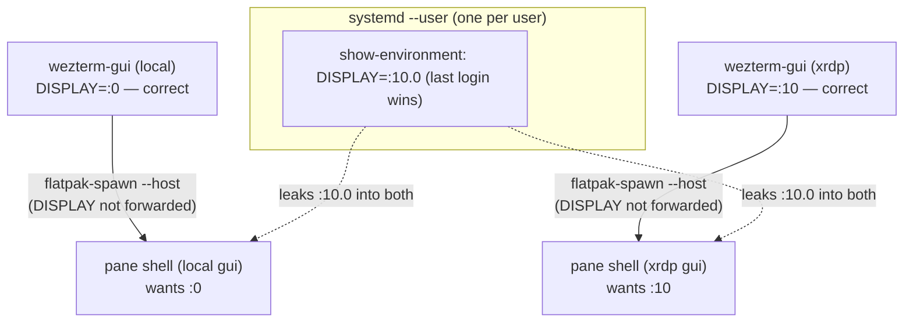

# Session DISPLAY in local + xrdp coexistence

Why a terminal on the local seat could report the wrong `$DISPLAY` (e.g. `:10.0`
instead of `:0`) while both a local and an xrdp session are logged in, what the
root cause was, and why running wezterm natively removed it.

## Symptom

With both sessions logged in at once:

- local physical seat — `DISPLAY=:0`
- xrdp login — `DISPLAY=:10`

a shell running inside the **local** wezterm reported `DISPLAY=:10.0`. GUI programs
launched from that shell (fcitx5, and any other X client) then targeted the
wrong display. `ime-here` was written to work around exactly this.

## Root cause

This analysis describes the Flatpak build of wezterm, which is no longer used;
see [Resolution](#resolution). Several facts combined (all confirmed by
inspection on this machine at the time):

1. **Two concurrent X sessions, one shared user environment.** There is a
   single `systemd --user` manager per user. Its environment block
   (`systemctl --user show-environment`) holds **one** `DISPLAY`, overwritten by
   whichever session logged in last. After an xrdp login it becomes `:10.0`.

2. **wezterm ran as a Flatpak.** Panes were spawned on the host with
   `flatpak-spawn --host`, which forwards only a curated set of variables
   (`TERM`, `COLORTERM`, `WEZTERM_*`, …) and **not** `DISPLAY`. The host shell
   therefore inherited `DISPLAY` from the shared `systemd --user` / D-Bus
   activation environment — the stale `:10.0`. This is the fact that no longer
   holds.

3. **Pane shells have no login session of their own.** They run under
   `user@1000.service` (the user manager), not under `session-c2.scope` or
   `session-c3.scope`. So `loginctl session-status` (no argument) cannot resolve
   the pane's real display; it falls back to the **seat** session (`c2` = `:0`).
   That is right for local panes only by coincidence and **wrong for xrdp
   panes** — which is why `ime-here` needs an explicit `ime-here :10` override.

4. **The GUI process still knows the truth.** Each wezterm-gui process was
   launched from its own session's i3, so it holds the correct per-instance
   `DISPLAY` (local gui `:0`, xrdp gui `:10`). This is the one reliable source.



## Resolution

wezterm now runs natively, installed from the fury.io apt repo by
`scripts/install.sh`. Panes are forked straight from the GUI process and inherit
its environment, so each pane gets that instance's own correct `DISPLAY`. Fact 2
was the whole of the problem, and it no longer holds:

```sh
$ WEZTEST_MARKER=from-gui wezterm start --always-new-process -- \
    bash -c 'echo "$WEZTEST_MARKER $DISPLAY"'
from-gui :10.0
```

`WEZTEST_MARKER` is on no forwarding list; it reaches the pane because the pane
inherits the GUI's environment wholesale. Under `flatpak-spawn --host` only the
curated set survived, so `DISPLAY` had to be re-injected from the config, which
is evaluated inside the GUI process and could therefore see the correct value:

```lua
-- removed with the move to native wezterm: this now sets DISPLAY to the value
-- the pane already inherits.
local gui_display = os.getenv("DISPLAY")
if gui_display and gui_display ~= "" then
	config.set_environment_variables = { DISPLAY = gui_display }
end
```

> Note: `wezterm.getenv` is **not** available in the packaged wezterm
> (20240203-110809); it errors with `attempt to call a nil value`. Use the
> standard Lua `os.getenv` if a config ever needs to read the environment again.

## Approaches that did not work (and why)

- **Setting `DISPLAY` in `~/.xsessionrc`.** `.xsessionrc` only affects the X
  session process tree, not the shared `systemd --user` / D-Bus environment the
  Flatpak panes read. And a single shared value cannot be correct for
  two concurrent displays — last writer wins, which is the bug itself. In
  `.xsessionrc` `$DISPLAY` is already correct per session; nothing to fix there.

- **Correcting `DISPLAY` in `~/.bashrc` via `loginctl`.** Pane shells live in
  `user@1000.service` with no session, so `loginctl` returns the seat session
  (`:0`) for every pane — correct for local, wrong for xrdp. Deriving it instead
  from `WEZTERM_UNIX_SOCKET` → gui pid → the gui's `DISPLAY` would be reliable
  but heavy (per-shell `/proc` lookups) and shell-only. Reading it from the GUI's
  own environment is the right answer, and native panes get it for free.

## Verification

1. Reload/restart the **local** wezterm, open a new tab, and check:
   ```sh
   echo $DISPLAY        # expect :0 on the local seat
   ```
2. Launch a GUI from that pane and confirm it appears on the local screen:
   ```sh
   rofi -show drun      # or: xterm
   ```
3. From an **xrdp** session, repeat: a new pane should report `:10` and GUI apps
   should appear on the xrdp screen.
4. After a full logout/login of both sessions, re-check both — this is the case
   the shared-environment bug used to break.

## Diagnostic commands (for future debugging)

```sh
# Per-user shared environment (the stale-DISPLAY source)
systemctl --user show-environment | grep -i display

# Each login session and its display
loginctl list-sessions
for s in $(loginctl list-sessions --no-legend | awk '{print $1}'); do
  echo "$s -> $(loginctl show-session $s -p Display --value)"
done

# A pane's leaked DISPLAY vs the true display of its owning GUI
echo "$DISPLAY  sock=$WEZTERM_UNIX_SOCKET"
gui=$(ss -xlp | grep "$WEZTERM_UNIX_SOCKET" | grep -oE 'pid=[0-9]+' | head -1 | cut -d= -f2)
tr '\0' '\n' < /proc/$gui/environ | grep '^DISPLAY='   # the correct value

# Which X servers exist
ls -l /tmp/.X11-unix/
```

## Related issue: wezterm GUI opens on the wrong session's screen

A separate but related symptom: launching wezterm from an **xrdp** session made
its window appear on the **local** screen (`:0`) instead of the xrdp screen.

This is **not** a `DISPLAY` problem and is unaffected by the pane-env fix above.
Its cause is wezterm's single-instance GUI feature:

1. wezterm keeps a GUI IPC socket at `$XDG_RUNTIME_DIR/wezterm/gui-sock-*`.
   `$XDG_RUNTIME_DIR` is `/run/user/1000` — **per user, shared by both X
   sessions** — and the socket name does not encode the display.
2. On launch, if that socket already has a GUI listening, wezterm does **not**
   create its own window; it asks the existing GUI to spawn one and then exits.
3. So a wezterm started under xrdp connects to the local GUI (`DISPLAY=:0`) over
   the shared socket, and the window is created by that local process — on the
   local screen. Confirmed by inspection: both local GUI processes share
   `gui-sock-2` and no wezterm process runs on `:10` after the xrdp launch.

**Fix:** launch the GUI with `start --always-new-process`, which forces each
invocation to become its own GUI in the calling session (inheriting that
session's correct `DISPLAY`) instead of delegating:

- `configs/i3/.config/i3/config` — `$mod+grave` binding.
- `configs/bash/.bashrc` — the `wezterm` shell wrapper adds the flag only on the
  GUI-start path (`wezterm` / `wezterm start`); `cli`, `ssh`, etc. pass through.

Trade-off: each window is a separate process (slightly more memory; windows are
not grouped under one instance). Acceptable given the coexistence requirement.

## Related issue: VS Code / Chrome window opens in the other session

Same shape as the wezterm case, with a different delegation key. Both apps are
single-instance per **profile**: the lock is keyed by `--user-data-dir` and its
socket lives in `$XDG_RUNTIME_DIR` (`/run/user/1000`, shared by both sessions).
A launch that picks the profile already held by the other session does not
create a window itself — it hands the request to that process, which opens the
window on **its** display. Hence the wrappers give the xrdp session its own
profile (`~/.vscode-remote-data`, `~/.config/google-chrome-remote`).

That separation broke because the wrappers keyed off `$XRDP_SESSION`, which is
**sticky**: `/etc/X11/Xsession.d/95dbus_update-activation-env` runs
`dbus-update-activation-environment --systemd --all`, copying the xrdp session's
whole environment into the per-user systemd/D-Bus activation environment. That
store is add/overwrite-only, so a later local login refreshes `DISPLAY` to `:0`
but cannot remove `XRDP_SESSION=1`:

```sh
$ systemctl --user show-environment | grep -E 'DISPLAY|XRDP_SESSION'
DISPLAY=:0            # local seat, logged in last
XRDP_SESSION=1        # left over from xrdp
```

Flatpak wezterm panes inherited that store directly, and a tmux server keeps its
start-time copy (`update-environment` lists `DISPLAY` but not `XRDP_SESSION`, so
only `DISPLAY` is refreshed on attach). A `code` run from a **local** pane
therefore saw `DISPLAY=:0` with `XRDP_SESSION=1`, took the xrdp branch, and
grabbed the xrdp profile — after which every xrdp launch was delegated to that
local window. Observed as: launching VS Code from rofi in the xrdp session
produced no window there, its log directory staying empty
(`~/.vscode-remote-data/logs/<ts>/`) because it delegated and exited.

**Fix:** decide per launch from `$DISPLAY`, the same socket test `~/.xsessionrc`
uses, in `configs/vscode/.local/bin/code` and
`configs/chrome/.local/bin/google-chrome-stable`:

```sh
_disp=${DISPLAY#:}; _disp=${_disp%%.*}
if [ -n "$_disp" ] && [ -S "/run/xrdp/sockdir/xrdp_display_${_disp}" ]; then …
```

Native panes no longer read the shared store, but tmux servers still carry a
stale `XRDP_SESSION`, so the wrappers keep deciding per launch. `$DISPLAY` is
correct in every launch path (i3/rofi natively, panes by inheritance, tmux via
`update-environment`), so the decision does not depend on an inherited marker. Note that already-running mismatched instances
keep their profile: close them, and reset a poisoned tmux server with
`tmux setenv -gu XRDP_SESSION` (or restart it) if anything else still reads it.

## Related

- `ime-here` in `configs/bash/.bashrc` (fcitx5 IME placement; trusts `$DISPLAY`
  directly, relying on panes inheriting the GUI's value instead of `loginctl`).
- `docs/remote-audio.md` (the xrdp audio side of local/remote coexistence).
